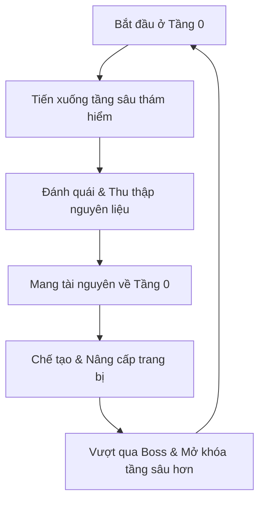

# CORE GAME DESIGN DOCUMENT

## Dự Án: Core RPG Framework v0.1

---

### 1. TẦM NHÌN CỐT LÕI (CORE VISION)

Người chơi đóng vai trò là một nhà thám hiểm độc lập. Bắt đầu từ **Tầng 0 (Căn cứ an toàn)**, người chơi liên tục thám hiểm xuống các tầng sâu hơn để thu thập nguyên liệu, đánh bại kẻ địch và gia tăng sức mạnh.



---

### 2. VÒNG LẶP GAMEPLAY CHÍNH (CORE GAMEPLAY LOOP)

Vòng lặp cơ bản được duy trì liên tục xuyên suốt trò chơi:

```text
       [ Tầng 0: Chuẩn bị trang bị & nâng cấp ]
                         │
                         ▼
        [ Thám hiểm hầm ngục & Tiêu diệt quái ]
                         │
                         ▼
       [ Thu thập nguyên liệu & Đánh bại Boss ]
                         │
                         ▼
     [ Mang chiến lợi phẩm về mở khóa tính năng mới ]
```

---

### 3. TẦNG 0 (SANCTUARY)

Tầng 0 đóng vai trò là trung tâm sinh hoạt, chế tạo và phát triển lâu dài của người chơi trong game.

#### 3.1. Đặc tính vật lý của Tầng 0
* **An toàn tuyệt đối:** Không xuất hiện quái vật.
* **Bất tử:** Người chơi không nhận sát thương từ bất kỳ nguồn nào.
* **Bảo toàn vật phẩm:** Không có rủi ro rơi đồ hoặc mất trang bị khi thao tác tại đây.

#### 3.2. Tiến trình mở khóa chức năng tại Tầng 0
Hệ thống tiện ích sẽ được mở rộng dần dựa theo tiến trình cốt truyện hoặc khi hạ gục Boss:

```mermaid
graph LR
    subgraph Ban Đầu (Default)
        A[Kho đồ]
        B[Bàn chế tạo]
        C[NPC Hướng dẫn]
    end
    subgraph Mở Khóa Dần (Progression)
        D[Thợ rèn]
        E[Phù thủy]
        F[Cây thiên phú]
        G[Giao dịch & Dịch chuyển]
    end
    
    A --> D
    B --> E
    C --> F
```

---

### 4. HAI LOẠI TIẾN TRÌNH (DUAL PROGRESSION SYSTEM)

Trò chơi vận hành song song hai hệ thống tiến trình để tạo ra động lực chơi ngắn hạn và dài hạn:

#### 4.1. Tiến trình Nhân vật (Character Progression)
Gia tăng sức mạnh chiến đấu trực tiếp của cá nhân người chơi qua:
* **Trang bị:** Sát thương cơ bản và các thuộc tính phòng ngự.
* **Kỹ năng:** Phong cách chiến đấu linh hoạt.
* **Thiên phú:** Các chỉ số bị động nâng cấp lâu dài.

#### 4.2. Tiến trình Căn cứ (Sanctuary Progression)
Nâng cấp Tầng 0 bằng cách mở khóa các dịch vụ và NPC mới sau mỗi cột mốc quan trọng (Ví dụ: Tiêu diệt Boss tầng).

---

### 5. NGUỒN SỨC MẠNH CỦA NGƯỜI CHƠI (POWER SOURCES)

Sức mạnh nhân vật được tổng hợp từ ba nguồn độc lập:

* **Trang bị (Equipment):** Nguồn sức mạnh chính, bao gồm Vũ khí, Giáp, và Phụ kiện (Nhẫn, dây chuyền).
* **Kỹ năng (Skills):** Có thể học tự do, thay đổi và trang bị lại tùy ý, không bị giới hạn hoặc khóa cứng theo bất kỳ Class nào.
* **Thiên phú (Talents):** Hệ thống cây nâng cấp bị động dài hạn chia làm 4 nhánh: *Tấn công*, *Phòng thủ*, *Tiện ích*, và *Sinh tồn*.

---

### 6. THIẾT KẾ KHÔNG LỚP NHÂN VẬT CỐ ĐỊNH (CLASSLESS PROGRESSION)

Trò chơi **không** giới hạn người chơi vào các Class truyền thống (Warrior, Mage, Archer) ngay từ đầu. Hướng xây dựng nhân vật (Build) hoàn toàn do sự kết hợp của:
$$\text{Build} = \text{Trang bị} + \text{Kỹ năng} + \text{Thiên phú}$$

#### Các ví dụ điển hình về Build linh hoạt:
* **Kiếm + Kỹ năng cận chiến** $\rightarrow$ Chiến binh (Warrior)
* **Cung + Kỹ năng tầm xa** $\rightarrow$ Cung thủ (Archer)
* **Trượng + Kỹ năng phép thuật** $\rightarrow$ Pháp sư (Mage)

---

### 7. CẤU TRÚC THẾ GIỚI & CHUỖI TIẾN TRÌNH

Thế giới được chia làm nhiều tầng sâu. Mỗi tầng là một hệ sinh thái riêng biệt:

```text
[Tầng 0: Sanctuary]
       │
       ▼
[Tầng 1: Quái vật A ➔ Nguyên liệu A ➔ Boss A]
       │
       ▼
[Tầng 2: Quái vật B ➔ Nguyên liệu B ➔ Boss B]
       │
       ▼
[Tầng 3: Quái vật C ➔ Nguyên liệu C ➔ Boss C]
```

#### Chuỗi tiến trình vượt tầng:
```text
Thu thập nguyên liệu ở tầng hiện tại 
  ➔ Chế tạo trang bị mới 
  ➔ Đánh bại Boss tầng 
  ➔ Nhận vật phẩm mở khóa tính năng mới ở Tầng 0 
  ➔ Tiến xuống tầng tiếp theo.
```

---

### 8. DANH SÁCH CÁC HỆ THỐNG LÕI BẮT BUỘC (CORE SYSTEMS)

Để vận hành game prototype, các hệ thống kỹ thuật sau bắt buộc phải được thiết kế và triển khai vững chắc:

1. **Combat (Chiến đấu):** Tính toán va chạm, tấn công, nhận sát thương, chết và cơ chế rơi đồ khi tử trận.
2. **Loot (Chiến lợi phẩm):** Quái vật rơi ra các loại nguyên liệu chế tạo cụ thể.
3. **Inventory (Hành trang):** Lưu trữ, sắp xếp và cơ chế cộng dồn (Stack) vật phẩm cùng loại.
4. **Equipment (Trang bị):** Cơ chế mặc, tháo trang bị và tính toán cộng dồn chỉ số thuộc tính vào nhân vật.
5. **Crafting (Chế tạo):** Sử dụng nguyên liệu theo công thức để chế tác ra trang bị/vật phẩm mới.
6. **Skill (Kỹ năng):** Cơ chế học kỹ năng mới, trang bị lên phím nóng, thay thế và nâng cấp kỹ năng.
7. **Talent (Thiên phú):** Cây kỹ năng bị động nâng cấp lâu dài cho nhân vật.
8. **Save System (Lưu trữ dữ liệu):** Đảm bảo ghi và tải nguyên vẹn dữ liệu nhân vật, trang bị, kho đồ, kỹ năng, thiên phú, trạng thái Tầng 0 và tiến trình thế giới.

---

### 9. PHẠM VI PHÁT TRIỂN & TRÌNH TỰ THỰC HIỆN

#### 9.1. Những thứ CHƯA cần thiết kế ở giai đoạn này
* Tên cụ thể của Boss, Skill, Item.
* Cốt truyện, hội thoại chi tiết (Lore).
* Đồ họa, Sprite đẹp, Animation phức tạp, Hiệu ứng Particle.

#### 9.2. Thứ tự phát triển đề xuất (Roadmap)
```text
1. Core Design Document (Hiện tại)
2. Inventory System
3. Item Database (Cơ sở dữ liệu vật phẩm mẫu)
4. Equipment System
5. Combat System
6. Loot System
7. Crafting System
8. Save System (Lưu trữ)
9. Tầng 0 (Sanctuary Map & Logic)
10. Progression System (Tiến trình thế giới)
11. Skill System (Trang bị kỹ năng tự do)
12. Talent System (Cây thiên phú bị động)
13. Boss System
14. Sản xuất Nội dung game chi tiết (Content)
```
