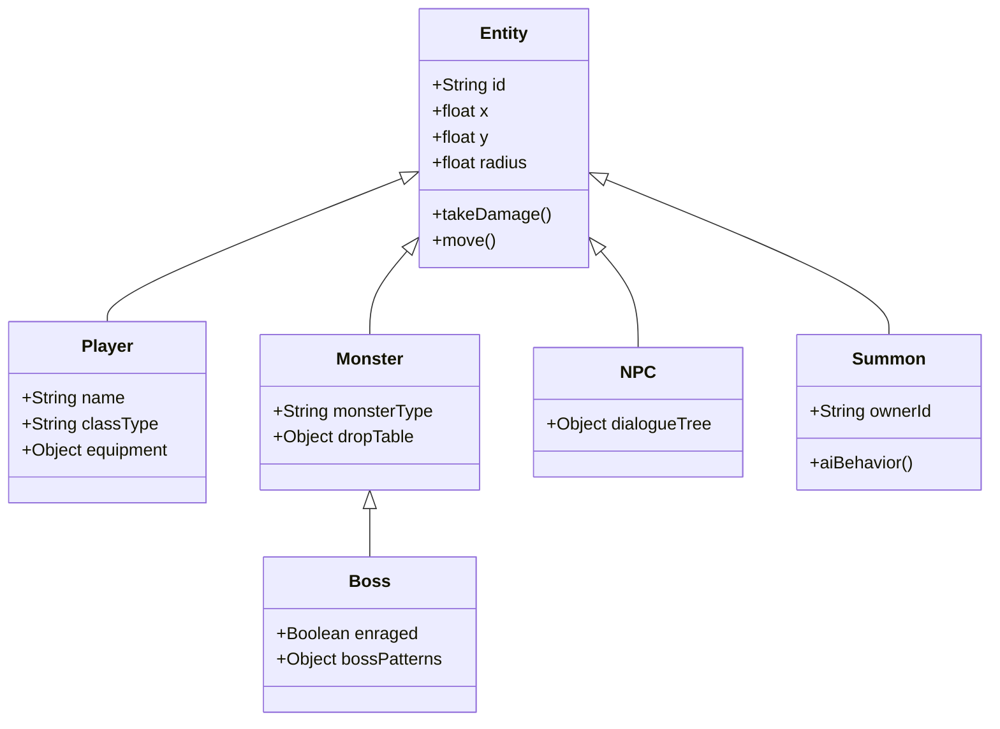
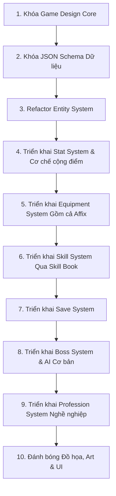

# GAME DESIGN & TECHNICAL ARCHITECTURE DOCUMENT

## Dự Án: Core RPG Framework v1.0

---

### 1. TẦM NHÌN PHÁT TRIỂN (DEVELOPMENT VISION)

Sai lầm lớn nhất của các dự án RPG là tập trung quá sớm vào số lượng nội dung (50 kỹ năng, 100 món đồ, 20 boss) trong khi các hệ thống cốt lõi (Combat, Inventory, Save Data, Entity) chưa ổn định.

**Chiến lược cốt lõi:** Tập trung 100% nguồn lực dựng cấu trúc "xương sống" của game trong 2-3 tuần đầu tiên. Khi nền móng đã đúng, việc mở rộng class, dungeon hay biome mới sẽ đạt tốc độ tối đa và tránh được rủi ro đập đi xây lại.

---

### 2. GIAI ĐOẠN 1: KHÓA THIẾT KẾ TRÒ CHƠI (GAME DESIGN CORE)

*Mục tiêu: Định hình và đóng băng (lock) toàn bộ thông số thiết kế hệ thống để làm căn cứ thiết kế cơ sở dữ liệu. Thời gian thực hiện: 1-2 ngày.*

#### 2.1. Giao diện & Hệ thống Lớp nhân vật (Classes)
Trò chơi khởi đầu với 6 lớp nhân vật cơ bản và cân bằng:

* **Knight:** Đỡ đòn, cận chiến, phòng thủ cao.
* **Mage:** Pháp sư, sát thương diện rộng, tiêu tốn mana.
* **Archer:** Xạ thủ, sát thương vật lý tầm xa, chí mạng.
* **Assassin:** Sát thủ, cơ động, dồn sát thương đơn mục tiêu.
* **Support:** Hỗ trợ, hồi máu, buff chỉ số.
* **Summoner:** Triệu hồi sư, điều khiển đệ tử (Summons).

#### 2.2. Hệ thống Chỉ số (Stats)
Bao gồm 5 thuộc tính cơ bản quyết định trực tiếp thuộc tính chiến đấu của thực thể:
* `Vigor` (Sức sống)
* `Strength` (Sức mạnh)
* `Dexterity` (Khéo léo)
* `Intelligence` (Trí tuệ)
* `Vitality` (Sinh lực)

#### 2.3. Ô trang bị (Equipment Slots)
Mỗi thực thể người chơi sở hữu 8 ô trang bị cố định:
1. Weapon (Vũ khí)
2. Helmet (Mũ)
3. Armor (Giáp ngực)
4. Gloves (Găng tay)
5. Boots (Giày)
6. Ring 1 (Nhẫn 1)
7. Ring 2 (Nhẫn 2)
8. Necklace (Dây chuyền)

#### 2.4. Phân cấp Độ hiếm (Item Rarity)
Vật phẩm được phân định theo thứ tự tăng dần từ thấp đến cao:
$$\text{Common} \longrightarrow \text{Uncommon} \longrightarrow \text{Rare} \longrightarrow \text{Epic} \longrightarrow \text{Legendary} \longrightarrow \text{Unique}$$

#### 2.5. Giao diện & Hệ thống Nghề nghiệp (Professions)
Hệ thống các hoạt động sản xuất và thu thập tài nguyên:
* `Blacksmith` (Rèn)
* `Alchemist` (Luyện kim)
* `Miner` (Khai khoáng)
* `Herbalist` (Hái thảo dược)
* `Hunter` (Săn bắn)
* `Cook` (Nấu ăn)
* `Enchanter` (Khảm nọc/Phù phép)

---

### 3. GIAI ĐOẠN 2: THIẾT KẾ CƠ SỞ DỮ LIỆU (DATA SCHEMA)

*Mục tiêu: Đảm bảo Schema đủ linh hoạt để sau này các hệ thống Boss, Quest, Crafting, Market, Guild đều có thể dễ dàng tích hợp vào.*

#### 3.1. Player Schema (Cơ sở dữ liệu Người chơi)
```json
{
  "id": "string (UUID)",
  "name": "string",
  "class": "string",
  "level": 1,
  "exp": 0,
  "stats": {
    "vigor": 10,
    "strength": 10,
    "dexterity": 10,
    "intelligence": 10,
    "vitality": 10,
    "unassignedPoints": 5
  },
  "equipment": {
    "weapon": "item_id_or_null",
    "helmet": "item_id_or_null",
    "armor": "item_id_or_null",
    "gloves": "item_id_or_null",
    "boots": "item_id_or_null",
    "ring1": "item_id_or_null",
    "ring2": "item_id_or_null",
    "necklace": "item_id_or_null"
  },
  "inventory": []
}
```

#### 3.2. Item Schema (Cơ sở dữ liệu Vật phẩm)
```json
{
  "id": "string (UUID)",
  "itemId": "string_base_id",
  "name": "string",
  "rarity": "string",
  "requiredClass": "string",
  "stats": {
    "flatStats": {},
    "affixes": []
  }
}
```

#### 3.3. Skill Schema (Cơ sở dữ liệu Kỹ năng)
```json
{
  "id": "string",
  "name": "string",
  "requiredClass": "string",
  "requiredLevel": 1,
  "manaCost": 10,
  "level": 1,
  "damageScale": 1.2
}
```

---

### 4. GIAI ĐOẠN 3: KIẾN TRÚC HỆ THỐNG THỰC THỂ (ENTITY SYSTEM REFACTOR)

Mọi đối tượng tương tác được trong thế giới game đều phải kế thừa từ một lớp cơ sở: `Entity`. Cấu trúc cây kế thừa được quy định như sau:



*Lưu ý kỹ thuật: Thiết kế phân cấp này giúp hệ thống quản lý đồng nhất cơ chế nhận sát thương, di chuyển, và giúp việc phát triển Class Summoner về sau cực kỳ đơn giản.*

---

### 5. GIAI ĐOẠN 4: TIẾN TRÌNH PHÁT TRIỂN NHÂN VẬT & HỆ THỐNG KỸ NĂNG (PROGRESSION & SKILLS)

#### 5.1. Cơ cơ chế Cộng điểm Chỉ số (Character Progression)
Thay vì hệ thống tự động tăng chỉ số khi lên cấp (`Level Up ➔ Damage+, HP+`), trò chơi áp dụng cơ chế Core RPG thuần túy:

$$\text{Level Up} \longrightarrow \text{Tặng +5 Stat Points} \longrightarrow \text{Người chơi tự phân phối vào Hệ thống Chỉ số (Stats)}$$

#### 5.2. Hệ thống Kỹ năng chủ động (Skill System)
Kỹ năng không tự động mở khóa. Người chơi phải thu thập thông qua vật phẩm `Skill Book`.
* **Quy trình:** Sử dụng `Fireball Book` ➔ Học được kỹ năng `Fireball Lv1`.
* **Cấu trúc tính toán dữ liệu:** Kỹ năng sẽ tăng tiến sức mạnh dựa trên tỷ lệ nhân chỉ số (`damageScale`) thay vì cộng raw damage cố định để giữ cân bằng game ở giai đoạn sau.

---

### 6. GIAI ĐOẠN 5: HỆ THỐNG PHỤ THUỘC TRANG BỊ & LƯU TRỮ (EQUIPMENT AFFIX & SAVE SYSTEM)

#### 6.1. Giao diện & Hệ thống Phụ tố Trang bị (Equipment Affix System)
Đây là tính năng cốt lõi tạo nên độ cuốn (replayability) của game. Cùng một vật phẩm cơ bản (ví dụ: `Iron Sword`), khi rơi ra sẽ ngẫu nhiên sinh ra các phụ tố (Affixes) khác nhau:
* *Iron Sword mẫu A:* `+5 Strength`
* *Iron Sword mẫu B:* `+4% Crit Rate`
* *Iron Sword mẫu C:* `+3% Lifesteal`

#### 6.2. Hệ thống Lưu trữ (Save System)
Phải được hoàn thiện sớm ngay sau khi có khung Schema. Hệ thống cần đảm bảo lưu trữ toàn vẹn dữ liệu của: `Level`, `Stats`, `Skills`, `Inventory`, `Equipment`, `Profession`.

---

### 7. PHẠM VI DỰ ÁN (PROJECT SCOPE CONTROL)

#### 7.1. Những thứ TUYỆT ĐỐI CHƯA LÀM ở giai đoạn đầu
Để tránh bẫy cạn kiệt tài nguyên trước khi game chạy được, nghiêm cấm đầu tư thời gian vào:
* **Đồ họa & Hiệu ứng:** Sprite đẹp, Animation phức tạp, Particle, Lighting.
* **Âm thanh:** Sound effects, BGM.
* **Số lượng (Quantity):** Chưa vội tạo ra 100 items, 50 skills, 30 bosses khi logic hệ thống chưa chạy mượt mà trên các khối vuông (white box).

#### 7.2. Lộ trình triển khai chuẩn (Roadmap)
Dự án bắt buộc phải tuân thủ nghiêm ngặt thứ tự 10 bước sau:



---
*Tài liệu này là kim chỉ quan kỹ thuật cho toàn đội dev. Mọi pull request vi phạm thứ tự triển khai hoặc tự ý thêm content khi chưa hoàn thành framework sẽ bị từ chối.*
